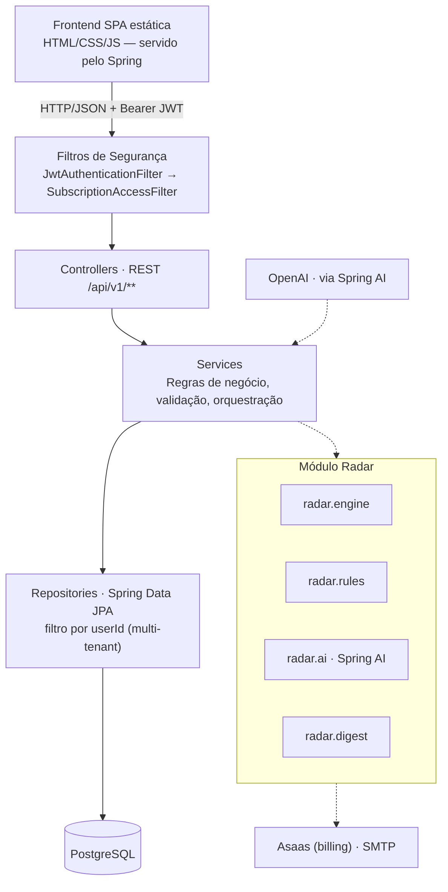
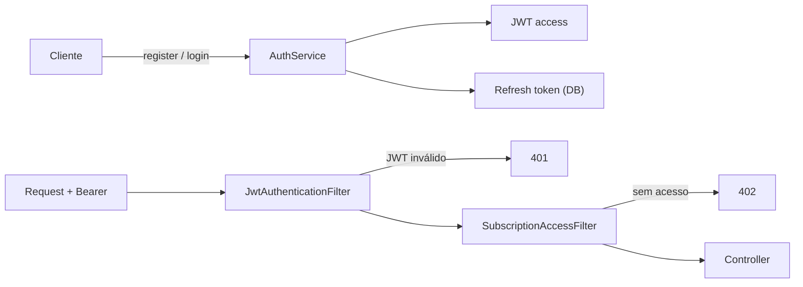
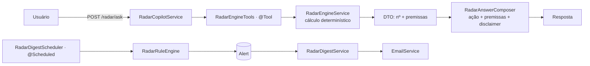

# FinanceDash — Documentação técnica

Aplicação de gestão financeira com copiloto de IA (**Radar**) para freelancers e MEIs.

**Stack:** Java 21 · Spring Boot 3 · Spring AI · PostgreSQL · Spring Security (JWT) · Asaas
**Versão do documento:** 1.0

---

## Sumário

1. [Visão geral](#1-visão-geral)
2. [Arquitetura](#2-arquitetura)
3. [Modelo de dados](#3-modelo-de-dados)
4. [Segurança e autenticação](#4-segurança-e-autenticação)
5. [Referência da API](#5-referência-da-api)
6. [FinanceDash Radar (em detalhe)](#6-financedash-radar-em-detalhe)
7. [Billing e assinatura](#7-billing-e-assinatura)
8. [Módulos e classes-chave](#8-módulos-e-classes-chave)
9. [Configuração e variáveis de ambiente](#9-configuração-e-variáveis-de-ambiente)
10. [Execução e deploy](#10-execução-e-deploy)
11. [Frontend](#11-frontend)
12. [Testes](#12-testes)

---

## 1. Visão geral

O FinanceDash é uma aplicação web de gestão financeira voltada a freelancers, MEIs e pequenos negócios. Além do controle de receitas, despesas, categorias e metas, inclui o **FinanceDash Radar** — um copiloto financeiro que projeta o resultado do mês, alerta riscos e responde perguntas em linguagem natural, sempre com números calculados de forma determinística no backend.

É um **monólito modular**: uma única aplicação Spring Boot (Java 21) que serve a API REST e o frontend estático, com PostgreSQL, autenticação JWT, cobrança via Asaas e IA via Spring AI/OpenAI.

| Camada | Tecnologias |
|---|---|
| Linguagem / runtime | Java 21 |
| Framework | Spring Boot 3 (Web, Data JPA, Security, Validation) |
| IA | Spring AI — starter OpenAI (modelo padrão `gpt-4o-mini`) |
| Banco de dados | PostgreSQL (Hibernate, `ddl-auto=update`) |
| Autenticação | Spring Security + JWT (stateless) + refresh tokens |
| Cobrança | Asaas (assinatura Pro, webhook) |
| Documentação de API | springdoc-openapi (Swagger UI) |
| Build / deploy | Maven · Docker (multi-stage) · Railway/Render |
| Frontend | HTML/CSS/JS (vanilla, módulos IIFE) + Chart.js — servido pelo Spring |
| Testes | JUnit 5 · Mockito · Playwright (E2E) |

---

## 2. Arquitetura

As requisições passam pelos filtros de segurança, chegam aos controllers REST, que delegam para os services (regras de negócio); estes acessam o banco pelos repositories. O módulo Radar é transversal e consome os mesmos services/repositories.



### 2.1 Regra de Ouro do Radar

> **A IA nunca calcula valores monetários.** Todo número (saldo, projeção, preço, gap) é produzido por código Java determinístico e testável (`radar.engine`). A camada de IA apenas interpreta a pergunta, chama a função correta e formata a resposta. Isso mantém os números auditáveis e confiáveis.

### 2.2 Estrutura de pacotes

| Pacote | Responsabilidade |
|---|---|
| `controller` | Endpoints REST (`/api/v1/**`). |
| `service` | Regras de negócio, validação e orquestração. |
| `repository` | Acesso a dados via Spring Data JPA (sempre filtrando por usuário). |
| `domain` | Entidades JPA e enums. |
| `dto` | Objetos de requisição e resposta da API (records). |
| `security` | JWT, filtros de autenticação e de assinatura, usuário atual. |
| `billing` | Cliente de integração com a Asaas. |
| `radar.engine` | Motor determinístico de cálculo financeiro. |
| `radar.rules` | Regras/limiares que geram alertas; agendador. |
| `radar.ai` | Copiloto (Spring AI function calling) e composição de respostas. |
| `radar.digest` | Resumo proativo (e-mail) e notificação de alertas críticos. |
| `config` | Propriedades, beans (Clock, OpenAPI), seeding, ajuste de URL do Railway. |
| `exception` | Exceções de negócio e handler global de erros. |

---

## 3. Modelo de dados

As entidades principais são isoladas por usuário (multi-tenant).

### 3.1 Entidades

| Entidade | Campos principais |
|---|---|
| `AppUser` | id, name, email, passwordHash, role, plan, subscriptionStatus, trialEndsAt, subscriptionEndsAt, asaasCustomerId, asaasSubscriptionId, emailVerified, timestamps |
| `Transaction` | id, user, description, amount, type, category, transactionDate, status, dueDate, recurring, recurrenceRule, clientId, clientName, essential, paymentMethod, notes, timestamps |
| `Category` | id, user, name, type, color, active, timestamps |
| `Goal` | id, user, title, month, year, targetAmount, type, category, createdAt |
| `UserSettings` | id, userId, monthlyIncomeGoal, monthlyReserveTarget, monthlyFixedCost, billableHoursPerMonth, taxRate, desiredMargin, digestFrequency, lastDigestSentAt, timestamps |
| `Alert` | id, userId, type, severity, message, actionSuggestion, dataSnapshot (JSON), createdAt, read |
| `RefreshToken` | id, token, user, expiresAt, revoked, createdAt |
| `UserActionToken` | id, token, user, purpose, expiresAt, used, createdAt |

### 3.2 Enums

| Enum | Valores |
|---|---|
| `TransactionType` | INCOME, EXPENSE |
| `TransactionStatus` | PENDING, PAID, OVERDUE |
| `RecurrenceRule` | NONE, WEEKLY, MONTHLY, YEARLY |
| `GoalType` | SAVINGS_TARGET, INCOME_TARGET, EXPENSE_LIMIT |
| `AlertType` | MONTH_NEGATIVE, BELOW_GOAL, OVERDUE_CLIENT, HIGH_SPENDING_PACE, RESERVE_AT_RISK, INCOMING_RECEIVABLE |
| `Severity` | INFO, WARNING, CRITICAL |
| `SubscriptionPlan` | FREE, PRO |
| `SubscriptionStatus` | TRIALING, ACTIVE, PAST_DUE, CANCELED |
| `UserRole` | USER, ADMIN |
| `TokenPurpose` | PASSWORD_RESET, EMAIL_VERIFICATION |
| `DigestFrequency` | NONE, DAILY, WEEKLY |

---

## 4. Segurança e autenticação

Autenticação stateless via JWT. Após login/registro, o cliente recebe um access token (JWT) e um refresh token persistido. Cada requisição passa por dois filtros antes do controller.



### 4.1 Filtros e regras

- **JwtAuthenticationFilter** — valida o JWT do header `Authorization` e popula o `SecurityContext`. Token inválido/ausente em rota protegida → **401**.
- **SubscriptionAccessFilter** — verifica trial/assinatura; sem acesso → **402** (Payment Required).
- **LoginRateLimiter** — bloqueia após **5 tentativas** de login em **15 minutos**.
- **Tokens de ação** — `UserActionToken` cobre reset de senha (validade 2h) e verificação de e-mail (48h); refresh token válido por 30 dias.

### 4.2 Rotas públicas (`permitAll`)

`POST /api/v1/auth/{register, login, refresh, forgot-password, reset-password}`, `GET /api/v1/auth/verify-email`, `POST /api/v1/billing/webhook`, Swagger (`/swagger-ui`, `/v3/api-docs`) e os estáticos (`/`, `/index.html`, `/css/**`, `/js/**`). Todas as demais exigem autenticação.

---

## 5. Referência da API

Base: `/api/v1`. Respostas em JSON. Salvo as rotas públicas (4.2), todos os endpoints exigem `Authorization: Bearer <token>` e operam sobre os dados do usuário autenticado.

### 5.1 Autenticação — `/auth`

| Método | Rota | Descrição / corpo |
|---|---|---|
| POST | `/auth/register` | Cria conta. `RegisterRequest {name, email, password}` → `AuthResponse {token, refreshToken, tokenType}` |
| POST | `/auth/login` | Autentica. `LoginRequest {email, password}` → `AuthResponse` |
| POST | `/auth/refresh` | Renova o access token. `RefreshTokenRequest {refreshToken}` → `AuthResponse` |
| POST | `/auth/forgot-password` | Envia link de redefinição. `ForgotPasswordRequest {email}` → `MessageResponse` |
| POST | `/auth/reset-password` | Redefine senha. `ResetPasswordRequest {token, password}` → `MessageResponse` |
| GET | `/auth/verify-email` | Verifica e-mail. Query: `token` → `MessageResponse` |
| GET | `/auth/me` | Dados do usuário atual → `UserResponse` |

### 5.2 Transações — `/transactions`

| Método | Rota | Descrição |
|---|---|---|
| POST | `/transactions` | Cria lançamento. `TransactionRequest` (ver 5.9) → `TransactionResponse` |
| GET | `/transactions` | Lista paginada. Query: `month, year, type, categoryId` + `page, size, sort` → `Page<TransactionResponse>` |
| GET | `/transactions/{id}` | Busca por ID → `TransactionResponse` |
| PUT | `/transactions/{id}` | Atualiza → `TransactionResponse` |
| DELETE | `/transactions/{id}` | Remove → `204` |

### 5.3 Categorias — `/categories`

| Método | Rota | Descrição |
|---|---|---|
| POST | `/categories` | Cria. `CategoryRequest {name, type, color}` → `CategoryResponse` |
| GET | `/categories` | Lista as ativas do usuário → `List<CategoryResponse>` |
| GET | `/categories/{id}` | Busca por ID → `CategoryResponse` |
| PUT | `/categories/{id}` | Atualiza → `CategoryResponse` |
| DELETE | `/categories/{id}` | Remove (soft delete) → `204` |

### 5.4 Metas — `/goals`

| Método | Rota | Descrição |
|---|---|---|
| POST | `/goals` | Cria. `GoalRequest {title, month, year, targetAmount, type, categoryId?}` → `GoalResponse` (com progresso) |
| GET | `/goals` | Lista todas → `List<GoalResponse>` |
| GET | `/goals/{id}` | Busca por ID → `GoalResponse` |
| PUT | `/goals/{id}` | Atualiza → `GoalResponse` |
| DELETE | `/goals/{id}` | Remove → `204` |
| GET | `/goals/monthly` | Metas do período. Query: `month, year` → `List<GoalResponse>` |

### 5.5 Dashboard — `/dashboard`

| Método | Rota | Descrição |
|---|---|---|
| GET | `/dashboard/monthly` | Resumo mensal. Query: `month (1-12), year` → `MonthlyDashboardResponse` (totais, saldo, contagens, agrupamentos por categoria) |

### 5.6 Configurações do usuário — `/user-settings`

| Método | Rota | Descrição |
|---|---|---|
| GET | `/user-settings` | Perfil financeiro → `UserSettingsResponse` |
| PUT | `/user-settings` | Atualiza. `UserSettingsRequest {monthlyIncomeGoal, monthlyReserveTarget, monthlyFixedCost, billableHoursPerMonth, taxRate, desiredMargin}` → `UserSettingsResponse` |

### 5.7 Radar — `/radar`

| Método | Rota | Descrição |
|---|---|---|
| GET | `/radar/month-projection` | Projeção do saldo do mês → `MonthProjectionResult` |
| GET | `/radar/safe-to-spend` | Quanto é seguro gastar (total e por dia) → `SafeToSpendResult` |
| GET | `/radar/overdue-receivables` | Recebíveis atrasados e caixa travado → `OverdueReceivablesResult` |
| GET | `/radar/freelance-gap` | Se falta receita para a meta e horas extras → `FreelanceGapResult` |
| GET | `/radar/minimum-project-price` | Preço mínimo. Query: `estimatedHours` → `MinimumProjectPriceResult` |
| GET | `/radar/cut-analysis` | O que cortar para bater a meta → `CutAnalysisResult` |
| POST | `/radar/ask` | Copiloto IA. `RadarAskRequest {question}` → `RadarAskResponse {answer, usedFunction, data}` |
| GET | `/radar/alerts` | Alertas do usuário. Query: `unreadOnly` → `List<AlertResponse>` |
| POST | `/radar/alerts/{id}/read` | Marca alerta como lido → `AlertResponse` |

### 5.8 Billing — `/billing`

| Método | Rota | Descrição |
|---|---|---|
| POST | `/billing/checkout/pro` | Inicia checkout do plano Pro (Asaas) → `CheckoutResponse {plan, checkoutUrl}` |
| POST | `/billing/webhook` | Recebe eventos da Asaas (público; valida token) → `200` |

### 5.9 Principais DTOs

- **`TransactionRequest`**: description, amount, type, categoryId, transactionDate, **status, dueDate, isRecurring, recurrenceRule, clientId, clientName, essential**, paymentMethod, notes.
- **`MonthlyDashboardResponse`**: month, year, startDate, endDate, totalIncome, totalExpense, balance, transactionCount, incomeCount, expenseCount, expensesByCategory[], incomesByCategory[].
- **`UserResponse`**: id, name, email, role, plan, subscriptionStatus, trialEndsAt, subscriptionEndsAt, emailVerified, accessAllowed, accessMessage.

Erros seguem o formato padrão `{ timestamp, status, error, message, path }`, com `error` em `VALIDATION_ERROR`, `RESOURCE_NOT_FOUND` ou `INTERNAL_SERVER_ERROR` (`GlobalExceptionHandler`).

---

## 6. FinanceDash Radar (em detalhe)

Três camadas: motor de cálculo (determinístico), motor de regras (alertas) e copiloto de IA (linguagem natural).



### 6.1 Motor de cálculo (`radar.engine`)

`RadarEngineService`, em `BigDecimal` (HALF_EVEN, 2 casas), com `Clock` injetado para testabilidade. Cada função retorna um DTO com o resultado e a lista de **premissas**.

| Função / endpoint | Cálculo (resumo) |
|---|---|
| `projectMonthBalance` | `saldoProjetado = saldoAtual + receitasPrevistas − despesasProjetadas`; projeção de variáveis = `(gastoVariávelAtéHoje ÷ diasDecorridos) × diasRestantes` |
| `safeToSpend` | `disponível = receitaPrevista − fixasRestantes − reserva − variáveisJáFeitas`; `porDia = max(0, disponível) ÷ max(1, diasRestantes)` |
| `overdueReceivables` | por recebível vencido: `impacto = valor × diasAtraso`; ordena desc; soma o caixa travado |
| `needsMoreFreelance` | `gap = meta − saldoProjetado`; estima horas/receita extra necessárias |
| `minimumProjectPrice` | `custoHora = (custosFixos + metaLucro) ÷ horas`; `precoHora = custoHora ÷ (1 − taxRate)`; `preço = precoHora × horasEstimadas` |
| `cutAnalysis` | `gap = reserva − saldoProjetado`; ranqueia despesas por impacto e calcula o saldo após cortes |

### 6.2 Motor de regras e alertas (`radar.rules`)

`RadarRuleEngine` consome os DTOs do motor (não recalcula) e gera `Alert`, evitando duplicação no mesmo dia. `RadarAlertScheduler` roda diariamente (cron padrão `0 0 8 * * *`, `America/Sao_Paulo`).

| Regra (`AlertType`) | Condição | Severidade |
|---|---|---|
| `MONTH_NEGATIVE` | saldoProjetado < 0 | CRITICAL |
| `BELOW_GOAL` | saldoProjetado < meta | WARNING |
| `OVERDUE_CLIENT` | recebível atrasado > 7 dias | WARNING |
| `HIGH_SPENDING_PACE` | projeção de variáveis acima do orçamento | WARNING |
| `RESERVE_AT_RISK` | saldoProjetado < reserva | WARNING |
| `INCOMING_RECEIVABLE` | recebimento relevante a caminho | INFO |

### 6.3 Copiloto de IA (`radar.ai`)

`RadarCopilotService` usa **function calling** do Spring AI: as funções do motor são expostas como ferramentas (`@Tool`) em `RadarEngineTools`. O modelo interpreta a pergunta, escolhe a ferramenta, recebe o DTO, e a resposta é montada por `RadarAnswerComposer`, que sempre acrescenta **ação sugerida, premissas e o aviso "sugestão, não consultoria financeira"**. `RadarToolInvocationContext` registra qual função foi usada (devolvida em `usedFunction`).

A IA é **opcional por ambiente**: com `SPRING_AI_CHAT_MODEL=none` o backend opera em modo determinístico (endpoints REST diretos); definindo o provider e a `OPENAI_API_KEY`, o `/radar/ask` passa a responder em linguagem natural.

### 6.4 Proatividade (`radar.digest`)

`RadarDigestService` monta um snapshot (`RadarDigestSnapshot`) e, conforme a `digestFrequency` do usuário, envia um resumo por e-mail (`RadarDigestComposer`) via `EmailService`; alertas `CRITICAL` podem ser notificados na hora. `RadarDigestScheduler` dispara os envios agendados.

---

## 7. Billing e assinatura

O acesso é controlado por trial e assinatura. Novos usuários entram em `TRIALING`; o `SubscriptionAccessFilter` libera ou bloqueia (402) conforme o status.

- **Checkout:** `POST /billing/checkout/pro` → `BillingService` cria cliente/assinatura na Asaas (`AsaasClient`) e devolve a `checkoutUrl`.
- **Webhook:** `POST /billing/webhook` (público, valida token) → `BillingService` atualiza `plan`/`subscriptionStatus` conforme o evento de pagamento.
- **Estados:** `SubscriptionStatus` = TRIALING, ACTIVE, PAST_DUE, CANCELED; `SubscriptionPlan` = FREE, PRO.

---

## 8. Módulos e classes-chave

### 8.1 Services

| Service | Responsabilidade |
|---|---|
| `AuthService` | register, login, refresh, forgotPassword, resetPassword, verifyEmail |
| `TransactionService` | CRUD de lançamentos + listagem paginada/filtrada (`JpaSpecificationExecutor`) |
| `CategoryService` / `DefaultCategoryService` | CRUD de categorias; seeding de categorias padrão por usuário |
| `GoalService` | CRUD de metas + cálculo de progresso e consulta por mês |
| `DashboardService` | Monta o resumo mensal agregado |
| `UserSettingsService` | Lê/atualiza o perfil financeiro; `getOrCreate(userId)` |
| `AlertService` | Lista e marca alertas como lidos |
| `BillingService` | Checkout Pro e tratamento de webhook |
| `EmailService` / `LoggingEmailService` | E-mails (reset, verificação, digest, alerta crítico); impl. de log até configurar SMTP |
| `TokenService` | Cria refresh token, token de reset e de verificação |
| `LoginRateLimiter` | Controle de tentativas de login |

### 8.2 Security

| Classe | Papel |
|---|---|
| `SecurityConfig` | Cadeia de filtros, rotas públicas, CSRF off, sessão STATELESS |
| `JwtService` | `generateToken(user)`, `validateAndGetUserId(token)` |
| `JwtAuthenticationFilter` | Autentica a requisição a partir do JWT |
| `SubscriptionAccessFilter` | Bloqueia acesso sem assinatura/trial válido (402) |
| `CurrentUserService` | `getCurrentUser()` / `getCurrentUserId()` |
| `UserPrincipal` | Implementação de `UserDetails` |

### 8.3 Repositories

Spring Data JPA, todos com consultas escopadas por usuário. Destaques:

- `TransactionRepository` — `findByUserIdAndTransactionDateBetween`, `findByUserIdAndTypeAndStatusIn`; `JpaSpecificationExecutor` para filtros.
- `AlertRepository` — `existsByUserIdAndTypeAndReadFalseAndCreatedAtAfter` (deduplicação de alertas).
- `UserRepository` — `findByEmailIgnoreCase`, `findByAsaasSubscriptionId`.
- `UserSettingsRepository` — `findByUserId`.

### 8.4 Config

`AsaasProperties` (`app.asaas`), `AuthProperties` (`app.auth`), `MailProperties` (`app.mail`), `RadarAiProperties` (`app.radar.ai`), `RadarDigestProperties` (`app.radar.digest`); `RadarConfig` expõe o bean `Clock` (timezone configurável); `OpenApiConfig` configura o Swagger; `DataSeeder` popula dados iniciais; `RailwayDatabaseUrlEnvironmentPostProcessor` ajusta a URL do Postgres no Railway.

---

## 9. Configuração e variáveis de ambiente

Configuração em `application.yml`, com padrões de desenvolvimento. Em produção, defina ao menos: `JWT_SECRET`, credenciais do banco, `OPENAI_API_KEY` (se usar IA) e as chaves da Asaas/SMTP.

| Variável | Função | Padrão (dev) |
|---|---|---|
| `DATABASE_URL` | JDBC do PostgreSQL | `jdbc:postgresql://localhost:5432/financedash` |
| `DATABASE_USERNAME` / `DATABASE_PASSWORD` | Credenciais do banco | `financedash` / `financedash` |
| `SERVER_PORT` | Porta HTTP | `8080` |
| `PUBLIC_BASE_URL` | URL pública (links de e-mail) | `http://localhost:8080` |
| `JWT_SECRET` | Segredo de assinatura do JWT | *(trocar em produção)* |
| `JWT_EXPIRATION_SECONDS` | Validade do access token | `86400` (24h) |
| `SPRING_AI_CHAT_MODEL` | Provider de IA (`none` = determinístico) | `none` |
| `OPENAI_API_KEY` | Chave da OpenAI (para `/radar/ask`) | *(vazio)* |
| `OPENAI_MODEL` | Modelo de chat | `gpt-4o-mini` |
| `app.radar.timezone` / `app.radar.alerts-cron` | Fuso e agendamento de alertas | `America/Sao_Paulo` · `0 0 8 * * *` |
| `app.auth.*` | Limites de login e validade de tokens | 5/15min · reset 2h · verif. 48h · refresh 30d |
| `app.asaas.*` / `app.mail.*` | Integração Asaas e SMTP | *(definir em produção)* |

---

## 10. Execução e deploy

### 10.1 Local

Pré-requisitos: Java 21, Maven e PostgreSQL (ou Docker).

```bash
mvn spring-boot:run            # app em http://localhost:8080
docker compose up --build      # app + Postgres via Docker
```

Swagger UI: `/swagger-ui.html` · OpenAPI JSON: `/v3/api-docs` · Frontend: `/` (raiz).

### 10.2 Build e container

O `Dockerfile` é multi-stage (build com Maven 3.9/Temurin 21, runtime Temurin 21 JRE), empacota o jar e expõe a `8080`. O package é feito com `-DskipTests` no build da imagem.

### 10.3 Railway / Render

Como o frontend é servido pelo próprio Spring, publique o app inteiro num PaaS que roda o `Dockerfile` + Postgres gerenciado (Railway recomendado). Configure `DATABASE_URL` no formato `jdbc:postgresql://…` e `SERVER_PORT` a partir da porta injetada pelo PaaS. `RailwayDatabaseUrlEnvironmentPostProcessor` ajuda a converter a URL do Railway.

---

## 11. Frontend

Aplicação estática (sem build) servida pelo Spring a partir de `src/main/resources/static`. Módulos IIFE: `FinanceDashApi` (chamadas e refresh de token), `FinanceDashUi` (formatação, toasts, modais via `showModal`/`hideModal` com Esc e foco), e módulos por feature (`dashboard`, `transactions`, `categories`, `goals`, `auth`, `settings`, `radar`). Gráficos com Chart.js. Visões **Dashboard** e **Radar**.

---

## 12. Testes

Cobertura com JUnit 5 + Mockito (unitários e de serviço) e Playwright (E2E do frontend). Destaques:

- `RadarEngineServiceTest` — cálculos do motor e casos de borda (mês vazio, dia 1, divisão por zero).
- `TenantIsolationIntegrationTest` — garante isolamento de dados entre usuários (multi-tenant).
- `AuthServiceTest`, `BillingServiceTest`, `TransactionServiceTest`, `GoalServiceTest`, `CategoryServiceTest`, `DashboardServiceTest`, controllers (Transaction/Goal) e `RailwayDatabaseUrlEnvironmentPostProcessorTest`.

```bash
mvn test                                      # unitários e integração
npx playwright install && npm run test:e2e    # E2E (app rodando)
```

---

_Documento gerado a partir do código-fonte do repositório `finance-dash`. Mantenha-o sincronizado conforme o projeto evolui._
